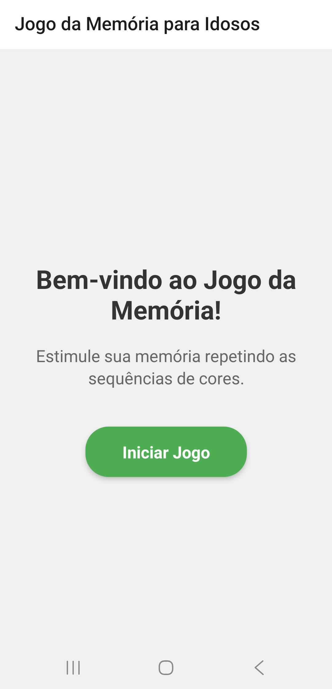
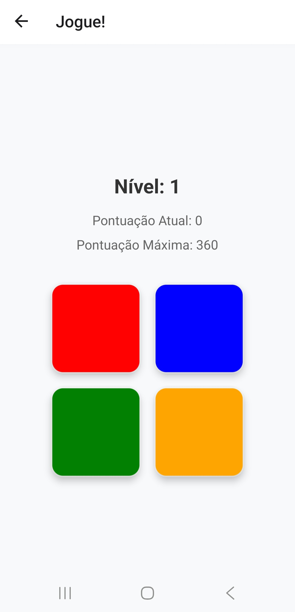
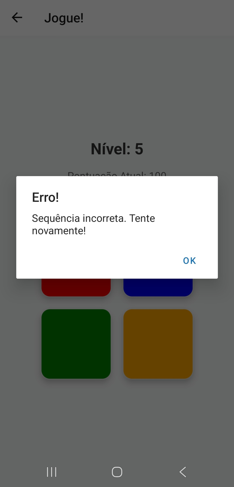

# MemoriaGame - Jogo da Memória para Idosos

<div align="center">
  

  
  
  
  
</div>

## Sobre o Projeto

O **MemoriaGame** é um aplicativo móvel desenvolvido em React Native, inspirado no clássico jogo de memória "Simon", onde o usuário deve repetir sequências de cores que aparecem na tela.

### Objetivo Principal
O foco principal é **estimular a memorização e a saúde cognitiva de idosos**, resolvendo problemas como o declínio da memória associado ao envelhecimento.

### Contexto Acadêmico
O projeto foi criado como **atividade de extensão acadêmica** na disciplina **"Programação para Dispositivos Móveis em Android" (DGT0303)**, com base na persona de uma idosa, usuária de celular Android, buscando inclusão digital e trabalho de memória.

### Tecnologias e Recursos
- **Interface gráfica interativa** com animações visuais
- **Persistência de dados** com AsyncStorage para pontuações
- **Sistema de áudio** integrado com sons para cada cor
- **Animações básicas** para feedback visual
- **Desenvolvimento e testes** utilizando Expo

## Tecnologias Utilizadas

### Core
- **React Native** 0.79.5 - Framework principal para desenvolvimento mobile
- **Expo** ~53.0.22 - Plataforma para desenvolvimento e build
- **TypeScript** ~5.8.3 - Tipagem estática para maior segurança

### UI & Animações
- **React Native Animated** - Animações nativas para feedback visual
- **React Native Gesture Handler** ~2.24.0 - Manipulação de gestos
- **React Native Reanimated** ~3.17.4 - Animações avançadas

### Áudio & Armazenamento
- **Expo AV** ^15.1.7 - Reprodução de áudio
- **@react-native-async-storage/async-storage** 2.1.2 - Persistência local

### Navegação & UI
- **@react-navigation/native** ^6.1.18 - Sistema de navegação
- **@react-navigation/stack** ^6.4.1 - Navegação em pilha
- **React Native Screens** 3.35.0 - Otimização de telas
- **React Native Safe Area Context** 4.12.0 - Áreas seguras

## Como Executar o Projeto

### Pré-requisitos

- **Node.js LTS 22.19.0** (recomendado)
- **Expo CLI** instalado globalmente
- **Dispositivo Android** ou emulador para testes

### Instalação e Execução

1. **Clone o repositório:**
   ```bash
   git clone https://github.com/Muowl/memoria-game-react.git
   cd memoria-game-react
   ```

2. **Instale as dependências:**
   ```bash
   npm install
   ```

3. **Inicie o servidor de desenvolvimento:**
   ```bash
   npx expo start
   ```

4. **Execute no dispositivo:**
   - **Android**: Pressione `a` no terminal ou escaneie o QR code com o app Expo Go
   - **Web**: Pressione `w` no terminal
   - **iOS**: Escaneie o QR code com a câmera (apenas dispositivos iOS)

### Comandos Úteis

```bash
# Limpar cache e reiniciar
npx expo start -c

# Executar no Android
npx expo start --android

# Executar na web
npx expo start --web

# Verificar dependências
npx expo-doctor
```

## Screenshots

### 🏠 Tela Inicial
<div align="center">
  
  <p><em>Tela de boas-vindas com instruções claras</em></p>
</div>

### 🎮 Jogo em Andamento
<div align="center">
  
  <p><em>Jogo mostrando sequência de cores no nível 1</em></p>
</div>

<div align="center">
  
  <p><em>Jogo com sequência mais complexa no nível 5</em></p>
</div>

### ❌ Tela de Falha
<div align="center">
  
  <p><em>Tela de erro com opção de reiniciar o jogo</em></p>
</div>

## Como Jogar

1. **Inicie o jogo** pressionando "Iniciar Jogo" na tela inicial
2. **Observe a sequência** de cores que aparecem na tela
3. **Repita a sequência** clicando nas cores na mesma ordem
4. **Avance de nível** quando completar corretamente
5. **Tente novamente** quando errar - o jogo reinicia automaticamente

### Sistema de Pontuação
- Cada nível completado dá pontos: `nível × 10`
- Pontuação máxima é salva automaticamente
- Progresso é mantido entre sessões
